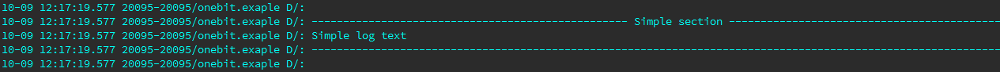
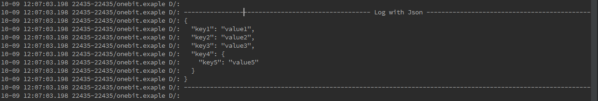

# Logger
Simple logger with support sections and json representation in the original form (only working with DEBUG logs)

Add it in your build.gradle at the end of repositories:

   ```java
   repositories {
        maven { url "https://jitpack.io" }
    }
  ```
    
Step 2. Add the dependency in the form

   
	dependencies {
	        compile 'com.github.scijoker:Logger:1.0'
	}	

===

<h3>Quick start:</h3>
```java
Logger.d("SampleActivity","Simple logs");
```	

```java	
Logger.dd("Simple section", "Simple log text");
```

```java	
Log.dd("Logs with json", "{"key1":"value1","key2":"value2","key3":"value3","key4":{"key5":"value5"}}");
```	


<h3>Log's color</h3>

For change logs color: http://stackoverflow.com/questions/19933731/colored-logcat-in-android-studio-by-colorpid
	
License
--------

    Copyright 2015 A.Prayzner, Inc.

    Licensed under the Apache License, Version 2.0 (the "License");
    you may not use this file except in compliance with the License.
    You may obtain a copy of the License at

       http://www.apache.org/licenses/LICENSE-2.0

    Unless required by applicable law or agreed to in writing, software
    distributed under the License is distributed on an "AS IS" BASIS,
    WITHOUT WARRANTIES OR CONDITIONS OF ANY KIND, either express or implied.
    See the License for the specific language governing permissions and
    limitations under the License.

